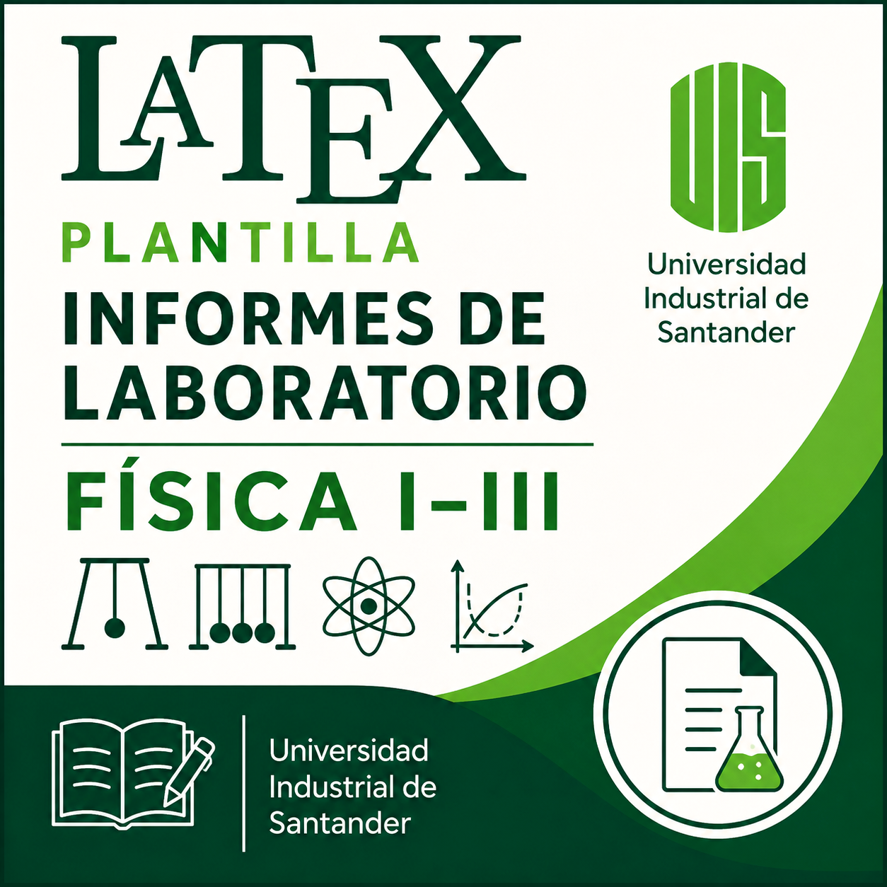
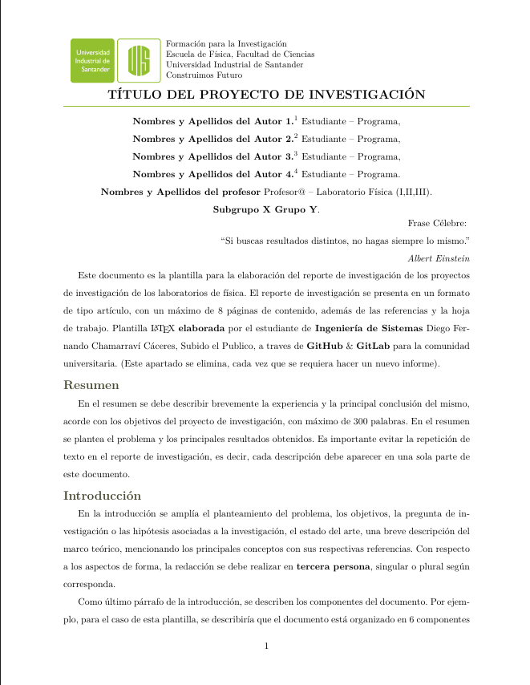
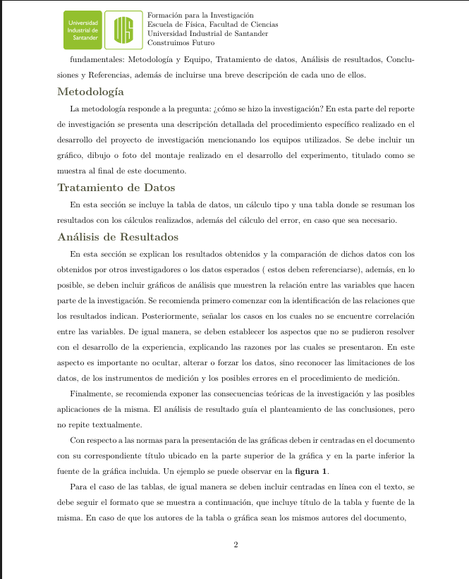

# 🔬 Plantilla LaTeX para Informes de Laboratorio de Física I, II y III - UIS

<div align="center">



<br><br>

<br><br>


### Plantilla académica estandarizada para la elaboración de informes y proyectos de investigación de los laboratorios de Física I, II y III de la Universidad Industrial de Santander (UIS).

*Desarrollada como una alternativa moderna, flexible y de código abierto para facilitar la redacción científica universitaria.*

</div>

---

## 📚 Contenido

- [📖 Descripción del Proyecto](#-descripción-del-proyecto)
- [🖼️ Vista Previa](#️-vista-previa)
- [✨ Características Principales](#-características-principales)
- [⚙️ Especificaciones Técnicas](#️-especificaciones-técnicas)
- [📝 Estructura del Documento](#-estructura-del-documento)
- [🚀 Cómo Utilizar la Plantilla](#-cómo-utilizar-la-plantilla)
- [📄 Plantilla Original en Word](#-plantilla-original-en-word)
- [🌟 Objetivo del Proyecto](#-objetivo-del-proyecto)
- [🤝 Contribuciones](#-contribuciones)
- [💡 Sugerencias y Contacto](#-sugerencias-y-contacto)
- [📜 Licencia](#-licencia)
- [👨‍💻 Autor](#-autor)

---

# 📖 Descripción del Proyecto

Este repositorio contiene una plantilla completa desarrollada en **LaTeX** para la elaboración de informes de laboratorio bajo el formato tipo artículo utilizado en la **Escuela de Física de la Universidad Industrial de Santander (UIS)**.

El proyecto busca ofrecer una herramienta que permita a los estudiantes concentrarse en el análisis físico, matemático y experimental de sus prácticas, dejando de lado los problemas relacionados con el formato, la diagramación y la gestión bibliográfica.

La plantilla incorpora elementos institucionales, encabezados personalizados, compatibilidad con normas APA y una estructura previamente organizada para la presentación de proyectos de investigación y reportes experimentales.

---

# 🖼️ Vista Previa

<div align="center">





</div>

---

# ✨ Características Principales

✅ Diseño tipo artículo científico.

✅ Compatible con Física I, Física II y Física III.

✅ Márgenes institucionales configurados automáticamente (2.54 cm).

✅ Encabezado oficial con identidad visual UIS.

✅ Gestión automática de referencias bibliográficas en formato APA.

✅ Soporte para ecuaciones matemáticas avanzadas.

✅ Integración completa con Overleaf, TeXStudio y Visual Studio Code.

✅ Compatibilidad con PDFLaTeX y LuaLaTeX.

✅ Organización modular y fácilmente personalizable.

---

# ⚙️ Especificaciones Técnicas

La plantilla está construida utilizando:

```latex
\documentclass[11pt]{article}
````

e incorpora diversos paquetes especializados para la producción de documentos científicos de alta calidad.

## Paquetes implementados

| Paquete       | Función                            |
| ------------- | ---------------------------------- |
| `babel`       | Configuración regional en español  |
| `amsmath`     | Ecuaciones matemáticas avanzadas   |
| `amssymb`     | Símbolos matemáticos adicionales   |
| `geometry`    | Configuración exacta de márgenes   |
| `fancyhdr`    | Encabezados y pies institucionales |
| `graphicx`    | Inserción de imágenes              |
| `transparent` | Transparencias y logotipos         |
| `tikz`        | Diagramas y elementos gráficos     |
| `biblatex`    | Referencias bibliográficas APA     |
| `hyperref`    | Hipervínculos internos y externos  |
| `titlesec`    | Personalización de títulos         |
| `xcolor`      | Colores institucionales UIS        |

---

# 📝 Estructura del Documento

La plantilla incorpora la estructura sugerida para la elaboración de proyectos e informes de investigación:

```text
📄 Informe
│
├── Resumen
├── Introducción
├── Marco Teórico
├── Metodología Experimental
├── Tratamiento de Datos
├── Análisis de Resultados
├── Conclusiones
├── Referencias Bibliográficas
└── Anexos
```

## Secciones incluidas

### 📌 Resumen

Espacio destinado a presentar los objetivos, metodología y resultados principales del trabajo.

### 📌 Introducción

Planteamiento del problema, estado del arte y fundamentos teóricos necesarios para comprender la investigación.

### 📌 Metodología

Descripción del montaje experimental, materiales utilizados y procedimientos realizados.

### 📌 Tratamiento de Datos

Tablas experimentales, análisis estadístico, propagación de errores e incertidumbres.

### 📌 Análisis de Resultados

Interpretación física y matemática de los resultados obtenidos.

### 📌 Referencias Bibliográficas

Sistema automático de citación bajo normas APA mediante BibLaTeX.

### 📌 Anexos

Sección destinada a incluir hojas de trabajo, cálculos complementarios o material adicional.

---

# 🚀 Cómo Utilizar la Plantilla

## 1. Clonar el repositorio

```bash
git clone https://github.com/TU-USUARIO/plantilla-latex-informes-fisica-uis.git
```

o desde GitLab:

```bash
git clone https://gitlab.com/MrChamarravi-Dev/plantilla-latex-informes-laboratorio-fisica-i-iii-universidad-industrial-de-santander.git
```

---

## 2. Abrir el proyecto

Puede utilizar cualquiera de los siguientes entornos:

* Prism - AI LaTex Editor: https://prism.openai.com/
* Overleaf: https://www.overleaf.com/
* TeXStudio: https://www.texstudio.org/
* Visual Studio Code + LaTeX Workshop
* Texmaker: https://www.xm1math.net/texmaker/

---

## 3. Modificar los datos del informe

Actualizar:

* Título del proyecto
* Autores
* Profesor
* Grupo o subgrupo
* Fecha
* Bibliografía

---

## 4. Compilar el documento

La plantilla es compatible con:

```bash
pdflatex
```

o

```bash
lualatex
```

---

# 📄 Plantilla Original en Word

Dentro del repositorio se encuentra la carpeta:

```text
Plantilla-Original-Word-Laboratorio_Fisica_I_III
```

la cual contiene la versión oficial en formato `.docx` proporcionada por la **Escuela de Física de la Universidad Industrial de Santander**.

Esta implementación en LaTeX fue desarrollada tomando como referencia dicha plantilla institucional, respetando la estructura, organización y lineamientos académicos establecidos.

Es importante aclarar que el uso de la plantilla original en Word continúa siendo completamente válido y aceptado para la presentación formal de los informes.

---

# 🌟 Objetivo del Proyecto

El propósito principal de este proyecto es fomentar el uso de herramientas profesionales de redacción científica dentro de la comunidad universitaria, facilitando la producción de documentos académicos de alta calidad y promoviendo el software libre y el conocimiento abierto.

Se espera que esta plantilla pueda beneficiar a futuras generaciones de estudiantes de la UIS y servir como base para nuevos desarrollos académicos.

---

# 🤝 Contribuciones

Las contribuciones son bienvenidas.

Si desea mejorar la plantilla, corregir errores o añadir nuevas funcionalidades, puede:

1. Realizar un **Fork** del proyecto.

2. Crear una nueva rama:

```bash
git checkout -b nueva-funcionalidad
```

3. Realizar sus cambios.

4. Enviar un **Pull Request**.

Toda ayuda es apreciada por la comunidad.

---

# 💡 Sugerencias y Contacto

<div align="center">

|            Medio            | Información                 |
| :-------------------------: | :-------------------------- |
|      📧 Correo Personal     | `diegochamarravi@gmail.com`       |
|    📧 Correo Alternativo    | `diegochamarravi1701@outlook.com`       |
| 🎓 Correo Institucional UIS | `diego2242008@correo.uis.edu.co` |
|          🎮 Discord         | `diegovlogs117`     |

</div>

Si encuentra errores, desea proponer nuevas funcionalidades o tiene sugerencias para mejorar la plantilla, puede comunicarse mediante cualquiera de los medios anteriores.

También puedes:

* 🐞 Abrir un **Issue** en GitHub.
* 🔀 Enviar un **Pull Request**.
* 🦊 Crear un **Merge Request** en GitLab.

Toda retroalimentación es bienvenida y contribuye al fortalecimiento de esta herramienta académica para la comunidad universitaria.

---

# 📜 Licencia

Este proyecto se distribuye como software libre con fines educativos y académicos.

Su utilización, modificación y distribución están permitidas siempre que se mantengan los créditos correspondientes al autor original y a la Universidad Industrial de Santander.

---

# 👨‍💻 Autor Plantilla LaTex

<div align="center">

## Diego Fernando Chamarraví Cáceres

**Estudiante de Ingeniería de Sistemas**
**Universidad Industrial de Santander (UIS)**

*"La tecnología y el conocimiento compartido construyen el futuro."*

Desarrollado como un aporte de código abierto para fortalecer la redacción científica y académica dentro de la comunidad universitaria.

🚀 **"Formación para la Investigación, ¡Construimos Futuro!"**

</div>
```